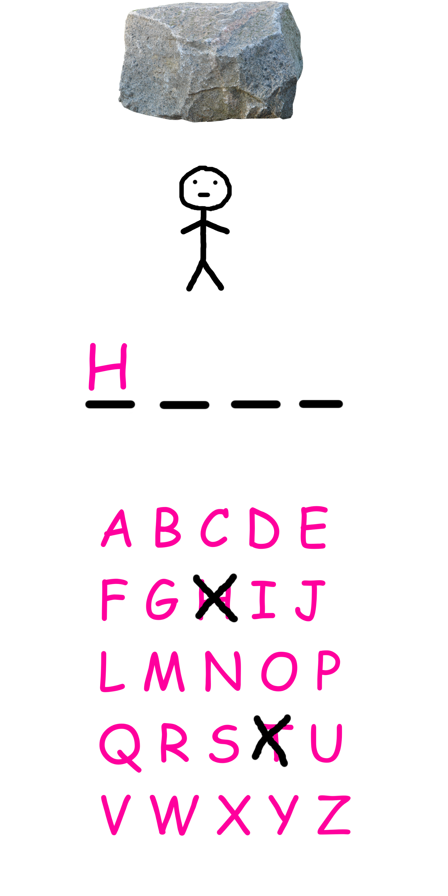

# Save him - Planering

## Idé

Jag ska göra ett spel för android som är inspirerat av hänga gubbe. Orden som används tas från detta dataset: [Academic Vocabulary Lists (Corpus-based; 120 million words)](https://www.academicvocabulary.info/). Orden är sorterade efter frekvens vilket jag tänker använda för att anpassa svårighetsgraden. De väljs från en gaussfördelning med medelvärde och standardavvikelse som användaren får välja. På så sätt kan man få spela med alla ord eller t.ex bara med de allra lättaste eller svåraste.

## Mockup

Storleken på mina mockupbilder är 1440 x 2880 px. Assets kommer sedan finnas i flera storlekar som anpassas beroende på upplösning.

Det första man ser när man öppnar appen är denna välkomnande skärm:

Sedan får man välja svårighet med två sliders:

Sedan börjar spelet:

När man förlorar:

När man vinner:

